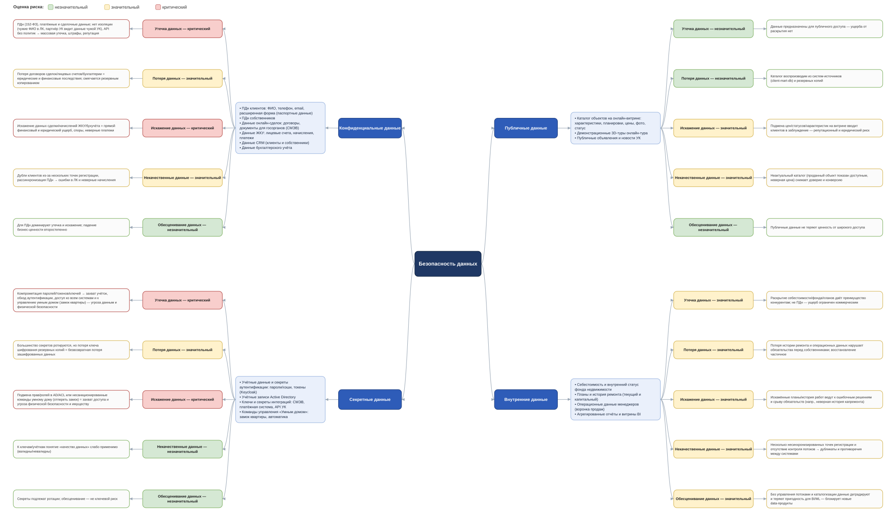

# Задание 1. Проверочный лист по безопасности данных

Проверочный лист по безопасности данных компании **PropDevelopment**, построенный по результатам анализа диаграммы контейнеров (C4) и описания системы.

Работа выполнена в четыре шага:

1. Анализ диаграммы и описания системы PropDevelopment.
2. Классификация данных по стандартам **ISO/IEC 27001 и 27002** на четыре категории: публичные, внутренние, конфиденциальные, секретные.
3. Определение рисков для каждой категории (утечка, потеря, искажение, некачественные данные, обесценивание) с обоснованием актуальности.
4. Оценка каждого риска по шкале **незначительный — значительный — критический**.

Результаты визуализированы в виде mindmap (draw.io).

## Файлы

| Файл | Назначение |
|------|------------|
| [`data-security-mindmap.drawio`](./data-security-mindmap.drawio) | Исходник mindmap для draw.io / diagrams.net (редактируемый) |
| [`data-security-mindmap.svg`](./data-security-mindmap.svg) | Превью mindmap для просмотра (см. ниже) |

**Как открыть исходник:** [app.diagrams.net](https://app.diagrams.net) → *File → Open* → `data-security-mindmap.drawio` (или desktop-приложение draw.io).

## Mindmap

Структура диаграммы: центр **«Безопасность данных»** → категории данных → конкретные данные компании → риск с оценкой → обоснование оценки. Цвет узла риска кодирует оценку: 🟢 незначительный · 🟡 значительный · 🔴 критический.

---

## Классификация данных (ISO/IEC 27001 / 27002)

| Категория | Какие данные PropDevelopment сюда относятся |
|---|---|
| **Публичные** | Каталог объектов на онлайн-витрине (характеристики, планировки, цены, фото, статус), демонстрационные 3D-туры, публичные объявления УК |
| **Внутренние** | Себестоимость и внутренний статус фонда недвижимости, планы и история ремонта (текущий/капитальный), операционные данные менеджеров (воронка), агрегированные отчёты BI |
| **Конфиденциальные** | ПДн клиентов (ФИО, телефон, email, расширенная форма с паспортными данными), ПДн собственников, данные онлайн-сделок (договоры, документы для госорганов/СМЭВ), данные ЖКУ (лицевые счета, начисления, платежи), CRM, бухучёт |
| **Секретные** | Учётные данные и секреты аутентификации (пароли/хэши, токены — Keycloak, Active Directory), ключи и секреты интеграций (СМЭВ, платёжная система, API УК), команды управления «Умным домом» (замок квартиры, автоматика) |

## Риски и оценки

Шкала: 🟢 незначительный · 🟡 значительный · 🔴 критический.

### Публичные данные

| Риск | Оценка | Обоснование |
|---|---|---|
| Утечка | 🟢 незначительный | Данные предназначены для публичного доступа — ущерба от раскрытия нет |
| Потеря | 🟢 незначительный | Каталог воспроизводим из систем-источников (client-mart-db) и резервных копий |
| Искажение | 🟡 значительный | Подмена цен/статусов/характеристик на витрине вводит клиентов в заблуждение — репутационный и юридический риск |
| Некачественные данные | 🟡 значительный | Неактуальный каталог (проданный объект показан доступным, неверная цена) снижает доверие и конверсию |
| Обесценивание | 🟢 незначительный | Публичные данные не теряют ценность от широкого доступа |

### Внутренние данные

| Риск | Оценка | Обоснование |
|---|---|---|
| Утечка | 🟡 значительный | Раскрытие себестоимости/фонда/планов даёт преимущество конкурентам; не ПДн — ущерб ограничен коммерческим |
| Потеря | 🟡 значительный | Потеря истории ремонта и операционных данных нарушает обязательства перед собственниками; восстановление частичное |
| Искажение | 🟡 значительный | Искажённые планы/история работ ведут к ошибочным решениям и срыву обязательств (напр., неверная история капремонта) |
| Некачественные данные | 🟡 значительный | Несколько несинхронизированных точек регистрации и отсутствие контроля потоков → дубликаты и противоречия между системами |
| Обесценивание | 🟡 значительный | Без управления потоками и каталогизации данные деградируют и теряют пригодность для BI/ML — блокирует новые data-продукты |

### Конфиденциальные данные

| Риск | Оценка | Обоснование |
|---|---|---|
| Утечка | 🔴 критический | ПДн (152-ФЗ), платёжные и сделочные данные; нет изоляции (чужие ФИО в ЛК, партнёр УК видит данные чужой УК), API без политик → массовая утечка, штрафы, репутация |
| Потеря | 🟡 значительный | Потеря договоров сделок/лицевых счетов/бухгалтерии = юридические и финансовые последствия; смягчается резервным копированием |
| Искажение | 🔴 критический | Искажение данных сделки/начислений ЖКУ/бухучёта = прямой финансовый и юридический ущерб, споры, неверные платежи |
| Некачественные данные | 🟡 значительный | Дубли клиентов из-за нескольких точек регистрации, рассинхронизация ПДн → ошибки в ЛК и неверные начисления |
| Обесценивание | 🟢 незначительный | Для ПДн доминируют утечка и искажение; падение бизнес-ценности второстепенно |

### Секретные данные

| Риск | Оценка | Обоснование |
|---|---|---|
| Утечка | 🔴 критический | Компрометация паролей/токенов/ключей → захват учёток, обход аутентификации, доступ ко всем системам и к управлению умным домом (замок квартиры) — угроза данным и физической безопасности |
| Потеря | 🟡 значительный | Большинство секретов ротируются, но потеря ключа шифрования резервных копий = безвозвратная потеря зашифрованных данных |
| Искажение | 🔴 критический | Подмена прав/ролей в AD/ACL или несанкционированные команды умному дому (отпереть замок) = захват доступа и угроза физической безопасности и имуществу |
| Некачественные данные | 🟢 незначительный | К ключам/учёткам понятие «качество данных» слабо применимо (валидны/невалидны) |
| Обесценивание | 🟢 незначительный | Секреты подлежат ротации; обесценивание — не ключевой риск |

---

## Ключевые выводы

- **Критические риски сосредоточены в конфиденциальных и секретных данных** — утечка и искажение. Это согласуется с заявленными проблемами компании: нарушенная изоляция данных (клиент видит чужие ФИО в личном кабинете; партнёр одной УК имеет доступ к данным другой) и отсутствие единых политик безопасности на API партнёров.
- **Для внутренних данных доминирует системная проблема качества и обесценивания** — отсутствие управления потоками данных напрямую блокирует развитие BI/ML/AI-сервисов.
- Проверочный лист задаёт приоритеты для предстоящего комплексного аудита безопасности: в первую очередь — контроль доступа и изоляция конфиденциальных данных, защита секретов и управление потоками данных.
