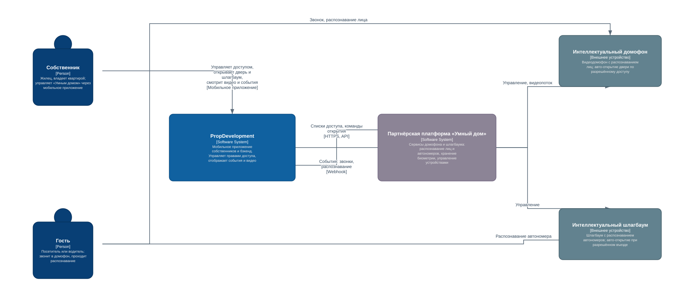
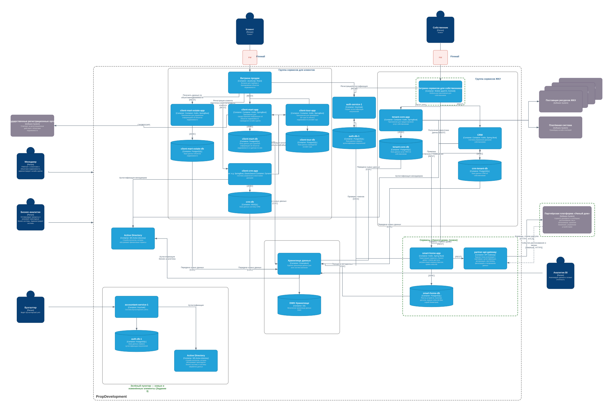

# Задание 3. Внешние интеграции — сервисы «Умный дом»

PropDevelopment расширяет функции для собственников за счёт партнёрских сервисов «Умного дома». Внедряются две услуги, доступные через **существующее мобильное приложение собственников**:

- **Интеллектуальный домофон** — видеодомофон с открытием по звонку и распознаванием лиц (авто-открытие при разрешённом доступе).
- **Интеллектуальный шлагбаум** — управление шлагбаумом с распознаванием автономеров (авто-открытие при разрешённом въезде).

Сервисы предоставляет внешний партнёр. В задании: диаграмма контекста, обновлённая диаграмма контейнеров и требования к интеграции.

## Файлы

| Файл | Назначение |
|------|------------|
| [`context-diagram.drawio`](./context-diagram.drawio) · [`.svg`](./context-diagram.svg) | Диаграмма контекста (C4) новых бизнес-функций |
| [`container-diagram.drawio`](./container-diagram.drawio) · [`.svg`](./container-diagram.svg) | Обновлённая диаграмма контейнеров PropDevelopment (доработка исходной C4-модели) |

Исходники открываются в [app.diagrams.net](https://app.diagrams.net) (*File → Open*). На диаграмме контейнеров **зелёным пунктиром** выделены новые и изменённые элементы.

---

## 1. Диаграмма контекста (C4)

**Акторы:**
- **Собственник** — через мобильное приложение управляет списками доступа, открывает дверь/шлагбаум удалённо, смотрит видео и события, получает уведомления.
- **Гость** (посетитель / водитель) — звонит в домофон или подъезжает к шлагбауму; проходит распознавание (лицо / автономер).

**Системы:**
- **PropDevelopment** — мобильное приложение собственников и бэкенд; хранит права доступа, отображает события и видео.
- **Партнёрская платформа «Умный дом»** (внешняя) — сервисы домофона и шлагбаума: распознавание лиц/номеров, **хранение биометрии**, управление устройствами.
- **Интеллектуальный домофон** и **Интеллектуальный шлагбаум** — устройства, подключённые к партнёрской платформе.

**Ключевое решение контекста:** биометрические шаблоны и распознавание остаются **на стороне партнёра**; PropDevelopment оперирует только правами доступа и метаданными событий. Это минимизирует обработку спецкатегории ПДн (биометрия) по 152-ФЗ.

---

## 2. Обновлённая диаграмма контейнеров

Доработка исходной C4-модели — добавлены элементы для интеграции «Умного дома» (выделены зелёным):

| Изменение | Что и зачем |
|---|---|
| ➕ **`smart-home-app`** (Kotlin, Spring Boot) | Оркестрация сервисов «Умного дома»: списки доступа (кто→какое устройство), ретрансляция команд открытия, приём событий от партнёра |
| ➕ **`smart-home-db`** (PostgreSQL) | Реестр устройств, политики доступа, журнал событий. **Без сырой биометрии** |
| ➕ **`partner-api-gateway`** (API Gateway) | Единая контролируемая точка интеграции с партнёром: аутентификация, авторизация, rate-limiting, фильтрация и логирование данных. Заодно закрывает проблему №2 из Task2 |
| ➕ **Партнёрская платформа «Умный дом»** (внешняя система) | Интеграция только через `partner-api-gateway` |
| ✏️ **Витрина сервисов для собственников** | Новые экраны «Умного дома»; обращается к `smart-home-app` по REST |
| ♻️ **auth-service-1** (Keycloak) | Переиспользуется для аутентификации собственников (OIDC, проверка токенов) |
| ➕ **CDC `smart-home-db` → Хранилище данных** | В хранилище передаются только метаданные событий, без биометрии |

Связи нового сервиса: `Витрина собственников → smart-home-app → {smart-home-db, partner-api-gateway, auth-service-1, CRM собственников}`; `partner-api-gateway ↔ Партнёрская платформа` (команды/списки доступа → ; события распознавания и звонки ←); `smart-home-db → Хранилище [CDC]`.

---

## 3. Требования к внешним интеграциям

### A. Требования к безопасности

1. **Биометрия — спецкатегория ПДн (152-ФЗ).** Биометрические шаблоны (лицо) и распознавание автономеров обрабатываются и хранятся **на стороне партнёра**; PropDevelopment хранит только права доступа и метаданные. Требуется явное согласие субъекта на обработку биометрии и механизм его отзыва.
2. **Минимизация данных.** Через интеграцию передаётся минимально необходимый набор (идентификаторы доступа, события), без избыточных ПДн. Контракты API проходят ревью на минимизацию (DLP-контроль передаваемых категорий).
3. **Изоляция арендаторов.** Собственник управляет только устройствами своего дома/подъезда/квартиры; каждый запрос авторизуется **на уровне объекта** (проверка привязки собственник↔помещение↔устройство). Исключается доступ к данным и устройствам других ЖК.
4. **Шифрование.** TLS 1.2+/mTLS для всех каналов «приложение↔бэкенд» и «PropDevelopment↔партнёр»; шифрование чувствительных данных at-rest; защищённое хранение и ротация секретов и ключей (vault).
5. **Аудит и журналирование.** Все события доступа (открытие двери/шлагбаума, изменение списков доступа: кто, когда, откуда) логируются неизменяемо и доступны службе ИБ — для разбора инцидентов и спорных ситуаций.
6. **Защита команд управления.** Команды открытия идемпотентны и защищены от повтора (anti-replay: nonce/timestamp), подписаны; применяются rate-limiting и защита от перебора.
7. **Fail-safe и безопасность жизни.** Управление физическим доступом должно иметь безопасное поведение при сбое (штатный режим домофона, ручное открытие), не блокируя выход; деградация без потери базовой функции.
8. **Мониторинг ИБ.** События интеграции поступают в мониторинг/SIEM; алертинг на аномалии (массовые открытия, всплески запросов, отказы распознавания).
9. **Юридические и организационные меры.** Соглашение об обработке данных (DPA) с партнёром; размещение/соответствие партнёра требованиям РФ (152-ФЗ); SLA, разграничение ответственности и порядок реагирования на инциденты; комплаенс-проверка партнёра.
10. **Конфиденциальность видео.** Видеопоток домофона передаётся по защищённому каналу, доступ — по краткоживущим токенам; в PropDevelopment не хранится без необходимости.

### B. Протоколы аутентификации и авторизации

- **Пользователь (собственник):** OAuth 2.0 / OpenID Connect через Keycloak (`auth-service-1`); access/refresh-токены (JWT) с коротким временем жизни и возможностью отзыва; **MFA** на чувствительные действия (изменение списков доступа, удалённое открытие).
- **Сервис-сервис (PropDevelopment ↔ партнёр):** OAuth 2.0 Client Credentials; взаимный TLS (**mTLS**); подпись запросов (JWS/HMAC); scoped-токены с минимальными правами.
- **Вебхуки/события (партнёр → PropDevelopment):** верификация подписи каждого вебхука (HMAC/JWS) + mTLS; проверка идемпотентности и временной метки (anti-replay).
- **Модель авторизации:** RBAC (роли: собственник, член семьи, гость) + ABAC/object-level (привязка субъект↔помещение↔устройство, временные окна доступа для гостей); принцип минимальных привилегий.
- **Управление ключами и токенами:** централизованное хранение секретов, регулярная ротация, немедленный отзыв при компрометации; отдельные ключи для каждого партнёра.

### C. Организация взаимодействия систем предприятия и внешней платформы

- **Единая точка интеграции — `partner-api-gateway`.** Весь трафик к партнёру и от него проходит через шлюз: аутентификация, авторизация, rate-limiting, фильтрация/минимизация данных, логирование, верификация подписей. Закрывает проблему №2 из Task2 (партнёрские API без единых политик).
- **Синхронные вызовы (команды):** `приложение → smart-home-app → partner-api-gateway → партнёр`, REST/HTTPS (JSON); идемпотентность, таймауты, ретраи с backoff, circuit breaker; контракты OpenAPI и версионирование.
- **Асинхронные события (звонки, распознавание, статусы):** `партнёр → partner-api-gateway (вебхук/стриминг) → smart-home-app → push-уведомления` в мобильное приложение; буферизация/очередь для устойчивости и подтверждение доставки.
- **Разделение владения данными:** биометрия и распознавание — у партнёра; `smart-home-app`/`smart-home-db` хранят реестр устройств, политики доступа и журнал событий (без сырой биометрии).
- **Авторизация на уровне объекта:** `smart-home-app` получает привязку собственник↔помещение из **CRM собственников**, токены проверяет через `auth-service-1` (OIDC).
- **Аналитика:** метаданные событий передаются в **Хранилище данных** через CDC (без биометрии) — для отчётности и будущих data-сервисов, с соблюдением минимизации.
- **Наблюдаемость и устойчивость:** сквозная трассировка запросов, метрики и алерты на шлюзе; контроль доступности партнёра и безопасная деградация (fail-safe).
